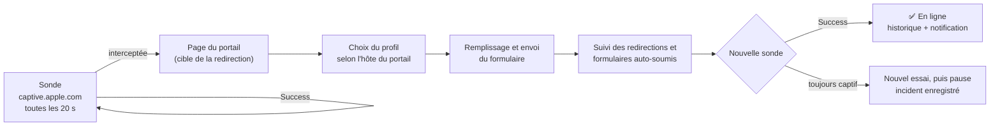

<div align="center">

# 🛡️ captive-watchdog

**Ne soyez plus jamais déconnecté des Wi-Fi publics limités dans le temps.**

Hôtels, B&B, aéroports, cafés : leur portail captif vous coupe toutes les quelques
heures et vous redemande votre e-mail. `captive-watchdog` s'en aperçoit en quelques
secondes et vous reconnecte en arrière-plan, sans navigateur.

[](#prérequis)
[](Package.swift)
[](LICENSE)

[English](README.md) · **Français**

</div>

---

## Pourquoi

Les portails à durée limitée sont pensés pour un téléphone et un onglet de
navigateur. Sur un portable, la session expire en pleine nuit, en pleine visio, au
milieu d'un téléchargement ou d'un `git push`, et rien ne vous prévient. On s'en rend
compte quand plus rien ne marche. Il faut alors ouvrir un navigateur, retrouver le
portail, retaper son e-mail, recocher la case.

`captive-watchdog` fait exactement ça à votre place, dès que c'est nécessaire :

- 🔍 **Détecte** le portail captif en moins de 20 s, comme le fait macOS.
- 📝 **Remplit** le formulaire de connexion : e-mail, case de consentement
  obligatoire, jetons cachés. Les opt-ins marketing restent **décochés**.
- 🔁 **Suit** tout l'enchaînement, y compris les formulaires cachés auto-soumis.
  Beaucoup de portails n'ouvrent l'accès qu'à cette seconde étape.
- ✅ **Vérifie** que l'Internet est revenu, et réessaie sinon.
- 🧾 **Garde une trace** de tout. Chaque reconnexion est inscrite dans l'historique,
  et chaque échec laisse un dossier d'analyse avec les pages rencontrées.

## Fonctionnement



L'app envoie elle-même une requête HTTP simple à la sonde de captivité d'Apple. Sur
un réseau captif, la passerelle l'intercepte et répond à la place avec le portail.
Le nom d'hôte de ce portail (par exemple `wifi.moveon-hotelbb.com`) désigne un
**profil**. Si aucun profil ne correspond, une heuristique générique traite la page,
et elle suffit pour la plupart des portails. Le SSID n'est pas nécessaire : macOS
le masque de toute façon aux processus d'arrière-plan.

## Fonctionnalités

**App de barre de menus** : une icône bouclier qui dit tout d'un coup d'œil.

| Icône | Signification |
|---|---|
| `checkmark.shield` | En ligne |
| `exclamationmark.shield` | Portail captif, échec en cours ou configuration à faire |
| `xmark.shield` | Hors ligne |
| `shield.slash` | Surveillance suspendue |

Le menu affiche le dernier renouvellement (« il y a 3 h — réseau (6 s) ») et propose
un bouton **Reconnecter maintenant**. Il ouvre aussi la fenêtre d'historique, le
journal, le dernier incident, un éditeur de profils avec test à blanc, et permet de
suspendre ou reprendre la surveillance.

**CLI** : le même moteur, scriptable. On peut le faire tourner comme démon
d'arrière-plan à la place de l'app.

**Profils** : un réseau qui demande un traitement particulier a droit à un petit
fichier JSON. On l'apprend à partir d'une page sauvegardée, on le teste hors ligne,
on le partage.

## Prérequis

- macOS 13 Ventura ou plus récent
- Toolchain Swift 6.1 (Xcode 16.4+ ou les Command Line Tools)

## Installation

> Un tap Homebrew est prévu. En attendant, compilation depuis les sources : environ
> une minute.

```sh
git clone https://github.com/CorentinGC/captive-watchdog.git
cd captive-watchdog

# CLI
swift build -c release --product captive-watchdog
install -m 755 .build/release/captive-watchdog /usr/local/bin/   # ou tout dossier du PATH

# App de barre de menus
Scripts/build-app.sh release
ditto .build/CaptiveWatchdog.app ~/Applications/CaptiveWatchdog.app

# Lancement à l'ouverture de session (launchd), et tout de suite
captive-watchdog install-agent --app ~/Applications/CaptiveWatchdog.app
```

Cliquez ensuite sur l'icône bouclier, puis **Configurer l'e-mail…**. C'est cette
adresse qui est saisie dans les portails : une adresse jetable convient très bien.

<details>
<summary>CLI seul, sans app de barre de menus</summary>

```sh
captive-watchdog config set email vous@example.com
captive-watchdog install-agent          # lance `captive-watchdog run` via launchd
```
</details>

## Utilisation

```text
captive-watchdog status [--json]            état, dernier renouvellement, instance active
captive-watchdog reconnect                  lance un cycle immédiatement
captive-watchdog history [-n N]             tentatives de reconnexion récentes
captive-watchdog logs [-n N] [-f]           le journal (suivi en continu avec -f)
captive-watchdog incidents [--reveal]       dossiers d'analyse des échecs
captive-watchdog profile list               profils disponibles
captive-watchdog profile learn <page.html> [--url URL] [--save]
captive-watchdog profile test  <page.html> [--url URL]   ce qui serait envoyé (rien ne l'est)
captive-watchdog config show | path | set <clé> <valeur>
captive-watchdog run [--once] [--force] [--verbose]      le moteur au premier plan
captive-watchdog install-agent [--app CaptiveWatchdog.app] | uninstall-agent
```

Un seul moteur tourne à la fois. Si le démon CLI est déjà lancé, l'app se contente
d'afficher son état et lui transmet **Reconnecter maintenant**.

### Configuration

`captive-watchdog config set <clé> <valeur>` : pris en compte au cycle suivant.

| Clé | Défaut | |
|---|---|---|
| `email` | — | Adresse envoyée aux portails (obligatoire) |
| `password` | — | Pour les rares portails qui demandent un code partagé |
| `interval` | `20` | Secondes entre deux sondes (minimum 5) |
| `retries` | `3` | Tentatives de connexion par coupure |
| `retryDelay` | `4` | Secondes entre deux tentatives |
| `failBackoff` | `300` | Pause après une coupure non résolue avant de réessayer |
| `notify` | `true` | Notification macOS à la reconnexion ou en cas d'échec |
| `verifyTLS` | `false` | Les portails ont souvent des certificats cassés |
| `keepIncidents` | `10` | Dossiers d'analyse conservés |
| `maxChainHops` | `4` | Formulaires auto-soumis suivis après le login |
| `skipCheckbox` | regex marketing | Cases qui doivent rester décochées |
| `probeURL` | sonde Apple | URL de vérification de captivité |

### Fichiers

| | |
|---|---|
| Config, état, historique, profils, incidents | `~/Library/Application Support/CaptiveWatchdog/` |
| Journal | `~/Library/Logs/CaptiveWatchdog/watchdog.log` |

`CAPTIVE_WATCHDOG_HOME` permet d'utiliser une autre racine, pour des tests par
exemple.

## Ajouter un réseau

La plupart des portails fonctionnent d'emblée. Quand l'un d'eux résiste, voici la
marche à suivre :

1. Pendant que vous êtes captif, enregistrez la page du portail depuis votre
   navigateur (`Fichier → Enregistrer sous…`, HTML seul). Vous pouvez aussi reprendre
   la page dans le dossier d'incident de la tentative ratée.
2. `captive-watchdog profile learn portail.html --url <URL du portail>` affiche un
   squelette de profil et explique ses choix.
3. `captive-watchdog profile test portail.html` montre exactement ce qui serait
   envoyé. Rien n'est envoyé.
4. Enregistrez avec `--save`, ou collez le profil dans **Profils…** dans l'app, qui
   le valide et peut lancer le même test à blanc.

Un profil décrit seulement **en quoi un réseau s'écarte du comportement générique**.
Toutes les clés sont facultatives :

```json
{
  "id": "bnb-hotels",
  "name": "B&B Hotels (Wifirst)",
  "match": { "portalHost": "(^|\\.)moveon-hotelbb\\.com$" },
  "form": {
    "action": "wifi-access\\.php",
    "fields": { "email": "email" },
    "checkboxes": { "check": ["chartConsent"], "skip": ["optinEmail"] },
    "submit": "connect"
  },
  "chain": { "maxHops": 4, "expectHosts": ["redirect-wifi.moveon-hotelbb.com"] }
}
```

Un profil utilisateur qui porte le même `id` qu'un profil intégré le remplace.

**Réseaux intégrés :** B&B Hotels (Wifirst). Les contributions sont bienvenues, voir
plus bas.

## Périmètre et usage loyal

`captive-watchdog` fait ce que vous feriez à la main : il accepte les conditions du
portail avec votre e-mail. Il **ne contourne pas** les quotas ni les limites de
durée. Il n'usurpe pas d'adresse MAC, ne change pas d'identité et ne casse aucune
authentification. Sont hors périmètre :

- les portails qui exigent un vrai compte, un code SMS ou un paiement ;
- les portails 100 % JavaScript, sans formulaire HTML.

Utilisez-le sur les réseaux auxquels vous avez droit, dans le respect de leurs
conditions.

Votre e-mail reste en local et il est caviardé dans les dossiers d'incident.

## Désinstallation

```sh
captive-watchdog uninstall-agent
rm -rf ~/Applications/CaptiveWatchdog.app /usr/local/bin/captive-watchdog
rm -rf ~/Library/Application\ Support/CaptiveWatchdog ~/Library/Logs/CaptiveWatchdog
```

## Contribuer

```sh
swift test                              # toute la suite tourne hors ligne
git config core.hooksPath .githooks     # active le garde-fou d'anonymat au commit
```

Les fixtures de test sont de **vraies pages de portail**, c'est ce qui fait leur
valeur. Avant d'en ajouter une, passez-la dans `Scripts/scrub.sh` : il retire les
jetons, les adresses MAC et IP, les identifiants de session et d'hôtel, et les
e-mails. Le garde-fou de pre-commit (`Scripts/check-anonymity.sh`) refuse tout ce
qui ressemble encore à une donnée personnelle.

Le document de conception se trouve dans
[`docs/superpowers/specs/`](docs/superpowers/specs/).

## Licence

[PolyForm Noncommercial 1.0.0](LICENSE). Vous pouvez utiliser, modifier et partager
ce logiciel pour tout usage **non commercial** : usage personnel, recherche,
enseignement, associations. Un usage commercial nécessite l'accord de l'auteur. Le
texte de la licence, en anglais, fait foi.
