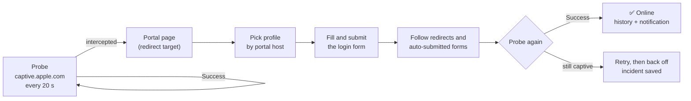

<div align="center">

# 🛡️ captive-watchdog

**Never get kicked off time-limited public Wi-Fi again.**

Hotels, B&Bs, airports, cafés: their captive portals drop you every few hours and
make you re-enter your e-mail. `captive-watchdog` notices within seconds and logs
you back in, in the background, without a browser.

[](#requirements)
[](Package.swift)
[](LICENSE)

**English** · [Français](README.fr.md)

</div>

---

## Why

Time-limited portals are designed for phones and a browser tab. On a laptop, the
session expires overnight or in the middle of a video call, a download, or a
`git push`, and nothing tells you. You find out when things stop working, then you
open a browser, find the portal, type your e-mail again and tick the box again.

`captive-watchdog` does exactly that for you, the moment it's needed:

- 🔍 **Detects** the captive portal within 20 s, the same way macOS does.
- 📝 **Fills in** the login form: e-mail, required consent checkbox, hidden tokens.
  Marketing opt-ins stay **unticked**.
- 🔁 **Follows** the whole chain, including auto-submitted hidden forms. Many portals
  only open the gate on that second step.
- ✅ **Verifies** that the Internet is back, and retries if it isn't.
- 🧾 **Keeps a record**: every reconnection lands in the history, and every failure
  gets a post-mortem folder with the pages that were seen.

## How it works



The app sends its own plain HTTP request to Apple's captivity probe. On a captive
network, the gateway intercepts it and answers with the portal instead. The host
name of that portal (for example `wifi.moveon-hotelbb.com`) selects a **profile**.
If no profile matches, a generic heuristic handles the page, and that is enough for
most portals. Some portals block DNS until you log in: when the probe cannot
resolve, it retries against Apple's IP address directly, so those are caught too.
No SSID is needed: macOS hides it from background processes anyway.

## Features

**Menu bar app**: a shield icon that tells you everything at a glance.

| Icon | Meaning |
|---|---|
| `checkmark.shield` | Online |
| `exclamationmark.shield` | Captive portal, failing, or needs setup |
| `xmark.shield` | Offline |
| `shield.slash` | Monitoring paused |

The menu shows the last renewal ("il y a 3 h — network (6 s)") and has a
**Reconnecter maintenant** button. It also gives access to the history window, the
log, the last incident, a profile editor with a dry-run tester, and pause/resume.
The interface is in French for now.

**CLI**: the same engine, scriptable. You can run it as a background daemon
instead of the app.

**Profiles**: a network that needs special handling gets a small JSON file, which
you can learn from a saved page, test offline, and share.

## Requirements

- macOS 13 Ventura or later
- Swift 6.1 toolchain (Xcode 16.4+ or the Command Line Tools)

## Installation

> A Homebrew tap is planned. For now, build from source; it takes about a minute.

```sh
git clone https://github.com/CorentinGC/captive-watchdog.git
cd captive-watchdog

# CLI
swift build -c release --product captive-watchdog
install -m 755 .build/release/captive-watchdog /usr/local/bin/   # or any directory on your PATH

# Menu bar app
Scripts/build-app.sh release
ditto .build/CaptiveWatchdog.app ~/Applications/CaptiveWatchdog.app

# Start it at login (launchd) and now
captive-watchdog install-agent --app ~/Applications/CaptiveWatchdog.app
```

Then click the shield icon and choose **Configurer l'e-mail…**. That address is what
gets typed into portals, so a disposable one is perfectly fine.

<details>
<summary>CLI only, no menu bar app</summary>

```sh
captive-watchdog config set email you@example.com
captive-watchdog install-agent          # runs `captive-watchdog run` under launchd
```
</details>

## Usage

```text
captive-watchdog status [--json]            state, last renewal, running instance
captive-watchdog reconnect                  run a cycle right now
captive-watchdog history [-n N]             recent reconnection attempts
captive-watchdog logs [-n N] [-f]           the log (follow with -f)
captive-watchdog incidents [--reveal]       post-mortem folders of failed attempts
captive-watchdog profile list               available profiles
captive-watchdog profile learn <page.html> [--url URL] [--save]
captive-watchdog profile test  <page.html> [--url URL]   what would be sent (nothing is)
captive-watchdog config show | path | set <key> <value>
captive-watchdog run [--once] [--force] [--verbose]      the engine in the foreground
captive-watchdog install-agent [--app CaptiveWatchdog.app] | uninstall-agent
```

Only one engine ever runs. If the CLI daemon is already running, the app simply
displays its state and relays **Reconnecter maintenant** to it.

### Configuration

`captive-watchdog config set <key> <value>`; changes apply on the next cycle.

| Key | Default | |
|---|---|---|
| `email` | — | Address submitted to portals (required) |
| `password` | — | For the rare portals that ask for a shared code |
| `interval` | `20` | Seconds between probes (min 5) |
| `retries` | `3` | Login attempts per outage |
| `retryDelay` | `4` | Seconds between attempts |
| `failBackoff` | `300` | Pause after a failed outage before trying again |
| `notify` | `true` | macOS notification on reconnection or failure |
| `verifyTLS` | `false` | Portals often have broken certificates |
| `keepIncidents` | `10` | Post-mortem folders kept |
| `maxChainHops` | `4` | Auto-submitted forms followed after login |
| `skipCheckbox` | marketing regex | Checkboxes that must stay unticked |
| `probeURL` | Apple's probe | Captivity check URL |

### Files

| | |
|---|---|
| Config, state, history, profiles, incidents | `~/Library/Application Support/CaptiveWatchdog/` |
| Log | `~/Library/Logs/CaptiveWatchdog/watchdog.log` |

Set `CAPTIVE_WATCHDOG_HOME` to use a different root, for example for testing.

## Adding a network

Most portals work out of the box. When one doesn't, here is the fix:

1. While captive, save the portal page from your browser (`File → Save As…`, HTML
   only). Or take the page from the incident folder of the failed attempt.
2. `captive-watchdog profile learn portal.html --url <portal URL>` prints a
   profile skeleton and explains its choices.
3. `captive-watchdog profile test portal.html` shows exactly what would be
   submitted. Nothing is sent.
4. Save it with `--save`, or paste it into **Profils…** in the menu bar app,
   which validates it and can run the same dry-run.

A profile only describes **how a network differs from the generic behaviour**.
Every key is optional:

```json
{
  "id": "bnb-hotels",
  "name": "B&B Hotels (Wifirst)",
  "match": { "portalHost": "(^|\\.)moveon-hotelbb\\.com$" },
  "form": {
    "action": "wifi-access\\.php",
    "fields": { "email": "email" },
    "checkboxes": { "check": ["chartConsent"], "skip": ["optinEmail"] },
    "submit": "connect"
  },
  "chain": { "maxHops": 4, "expectHosts": ["redirect-wifi.moveon-hotelbb.com"] }
}
```

A user profile with the same `id` as a built-in one replaces it.

**Built-in networks:** B&B Hotels (Wifirst). Contributions welcome, see below.

## Scope and fair use

`captive-watchdog` does what you would do by hand: it accepts the portal's terms
with your e-mail. It **does not** bypass quotas or time limits, spoof MAC
addresses, rotate identities, or break any authentication. Portals that require a
real account, an SMS code or a payment are out of scope, and so are portals that
are pure JavaScript with no HTML form. Use it on networks you are allowed to use,
under their terms.

Your e-mail is stored locally only, and is redacted from incident folders.

## Uninstall

```sh
captive-watchdog uninstall-agent
rm -rf ~/Applications/CaptiveWatchdog.app /usr/local/bin/captive-watchdog
rm -rf ~/Library/Application\ Support/CaptiveWatchdog ~/Library/Logs/CaptiveWatchdog
```

## Contributing

```sh
swift test                              # the whole suite runs offline
git config core.hooksPath .githooks     # enables the anonymity guard on commit
```

Test fixtures are **real portal pages**, which is what makes them valuable. Before
committing one, run it through `Scripts/scrub.sh`: it strips tokens, MAC and IP
addresses, session and hotel identifiers, and e-mails. The pre-commit guard
(`Scripts/check-anonymity.sh`) refuses anything that still looks personal.

The design document lives in [`docs/superpowers/specs/`](docs/superpowers/specs/) (in French).

## License

[PolyForm Noncommercial 1.0.0](LICENSE). You may use, modify and share this
software for any **non-commercial** purpose: personal use, research, education,
non-profits. Commercial use requires the author's permission.
